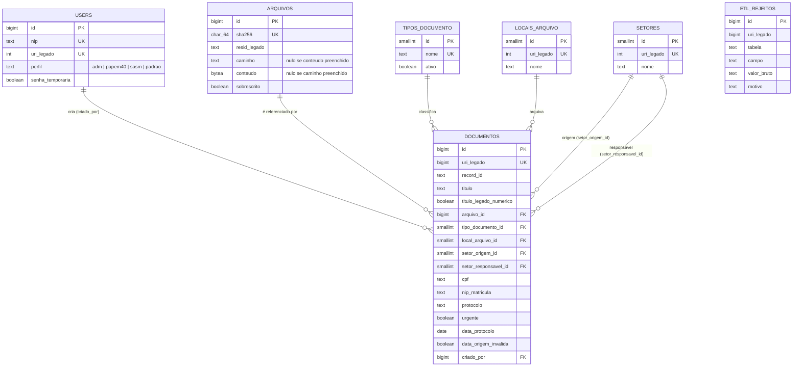

# SISIMAGEM — Diagrama de relacionamentos (ER)

Gerado a partir de `sisimagem-ddl.sql`. Renderiza em qualquer visualizador
Markdown com suporte a Mermaid (GitLab renderiza nativamente).

## Notas de leitura

- `ETL_REJEITOS` aparece sem seta no diagrama porque não tem chave
  estrangeira de propósito — precisa aceitar registro de log mesmo quando o
  dado de origem é inválido ao ponto de não corresponder a nenhuma linha
  criada nas outras tabelas.
- `SETORES` se relaciona com `DOCUMENTOS` duas vezes (origem e responsável) —
  é o mesmo padrão do `TSRECLOC` do legado, tipos 1 e 2, já separados em
  colunas distintas em vez de linhas.
- `ARQUIVOS` pode ser referenciado por mais de um documento — é a
  deduplicação por `sha256`: o mesmo arquivo físico anexado a processos
  diferentes vira uma linha só em `arquivos`.
- `uri_legado`, presente em quase toda tabela, não aparece como
  relacionamento porque não é FK — é chave de reconciliação com o Oracle
  de origem, usada pelo ETL para idempotência, não para integridade
  referencial dentro do banco novo.
