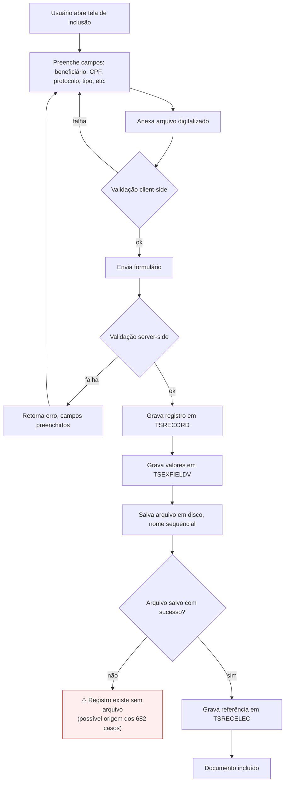
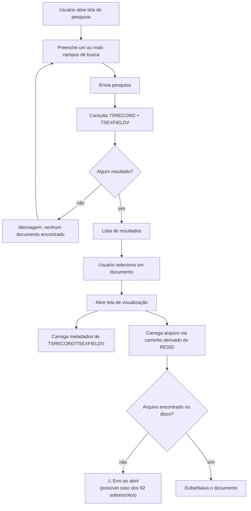
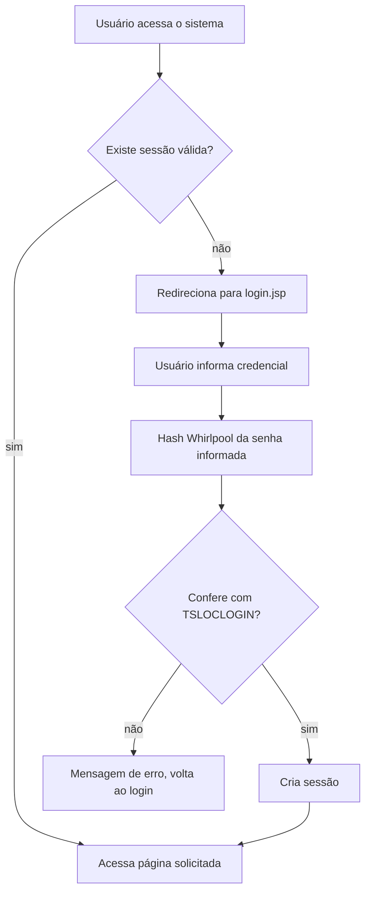
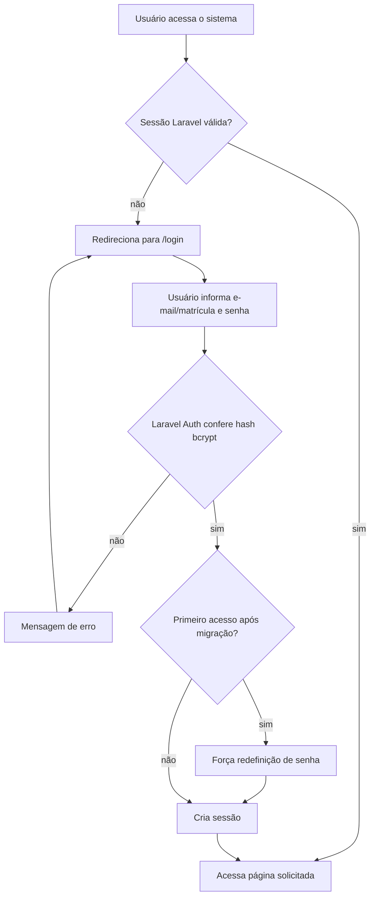
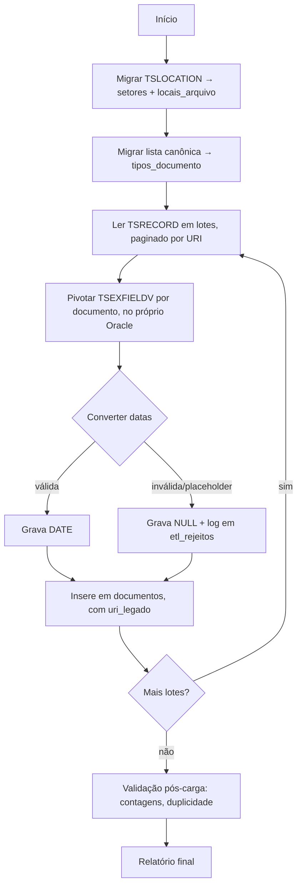
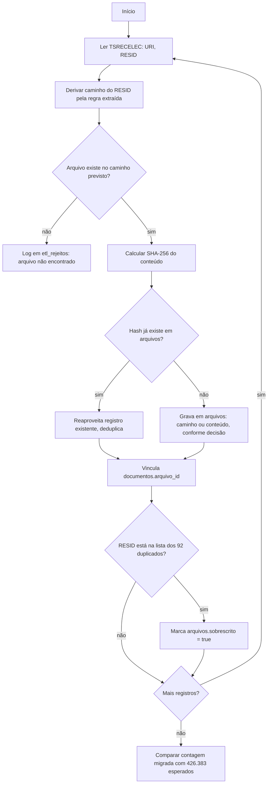

# SISIMAGEM — Fluxos

Diagramas para orientar a construção. Os fluxos 1 a 3 são o comportamento do
legado, inferido do código e do banco — a confirmar com o bloco de extração
do Claude Code e a entrevista com o PAPEM-40. Onde há incerteza, está
marcado.

---

## 1. Inclusão de documento

**Ponto de risco identificado:** a gravação do registro (H) e a gravação do
arquivo (J) não são atômicas. Se o passo J falhar depois do H ter sido
confirmado, o resultado é um documento sem arquivo — provável explicação dos
682 casos.

**No sistema novo:** envolver os dois em transação de banco, e só liberar o
upload do arquivo como parte da mesma operação. Se usar fila para o
processamento do arquivo, marcar o documento como "pendente" até a
confirmação.

---

## 2. Busca de documento

**Pendente de confirmação com o Militar 1:** quais campos são realmente
usados na busca. O diagrama assume que qualquer campo pode ser critério —
isso deve ser restringido aos campos que os usuários de fato utilizam
(seção 4 do roteiro de requisitos).

---

## 3. Autenticação (legado)

**Não migra:** o hash Whirlpool. No sistema novo, ver fluxo 3-B.

## 3-B. Autenticação (novo, local)

Os 235 usuários migrados entram com senha temporária e são obrigados a
trocar no primeiro acesso — não há como reaproveitar a senha do legado.

---

## 4. ETL de metadados (visão geral)

## 5. ETL de arquivos (visão geral)

**Bloqueado até:** validação da regra de caminho contra o servidor real, e
acesso de leitura ao diretório.

---

## Como usar isto ao programar

- Fluxos 1 e 2 orientam os métodos dos Controllers/Livewire das fatias 1 e 2
  do plano técnico.
- Fluxo 3-B é a especificação da autenticação, já pronta para implementar.
- Fluxos 4 e 5 são o roteiro dos Commands de ETL, na ordem em que devem ser
  escritos e executados.
- Os pontos marcados com ⚠ são exatamente os três riscos já reportados
  (documento sem arquivo, arquivo sobrescrito, arquivo órfão) — cada um
  aparece no diagrama no momento exato em que o problema se origina ou se
  manifesta.
