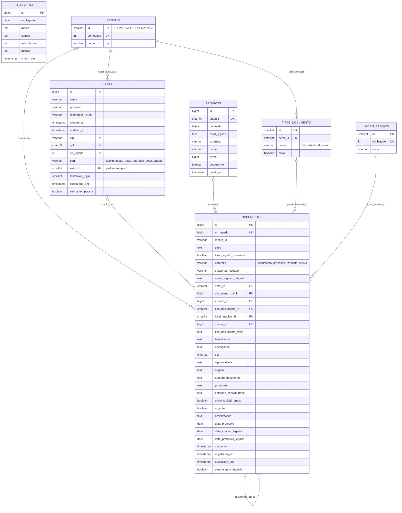

# SISIMAGEM: Diagrama de entidade-relacionamento (DER)

Todas as tabelas e todas as colunas do banco novo. O significado de cada
coluna está no dicionário de dados.

Legenda: PK = chave primária. FK = chave estrangeira. UK = valor único. Nas
ligações, o círculo indica que a ligação é opcional e o pé de galinha indica
"muitos".

## Quem vê o quê

| Perfil | Setor | Vê | Inclui | Edita e exclui |
|---|---|---|---|---|
| `admin` | nenhum | todos os setores | qualquer tipo | tudo |
| `gestor_setor` | PAPEM-41 ou PAPEM-42 | só o próprio setor | tipos do próprio setor | só o próprio setor |
| `operador_setor` | PAPEM-41 ou PAPEM-42 | só o próprio setor | tipos do próprio setor | não |
| `padrao` | sempre PAPEM-41 | só o PAPEM-41 | não | não |

Regra de visibilidade: `documentos.setor_id = users.setor_id`, exceto para o
admin. O documento filho tem o mesmo setor do pai.
