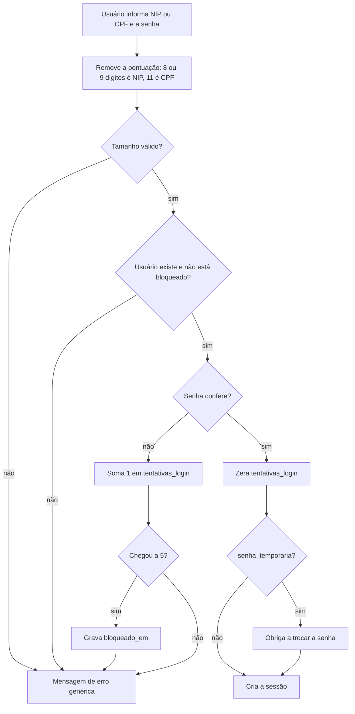
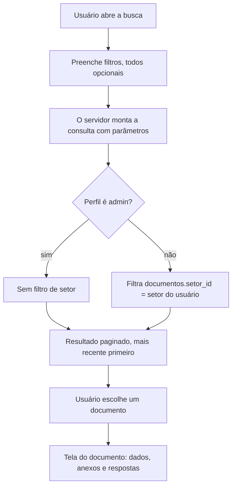
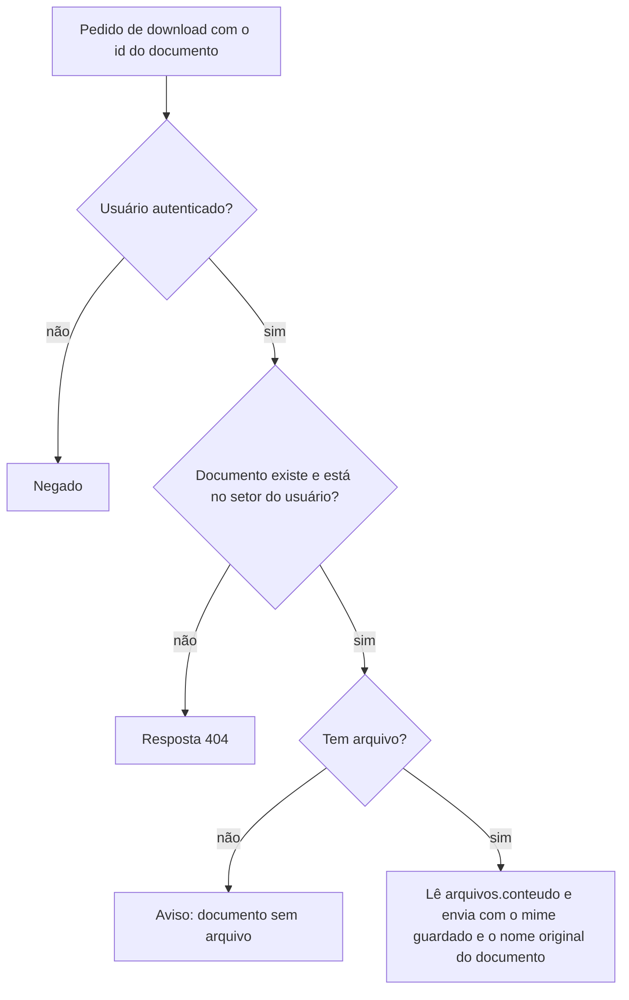
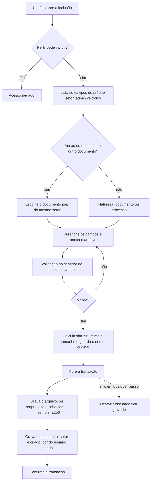
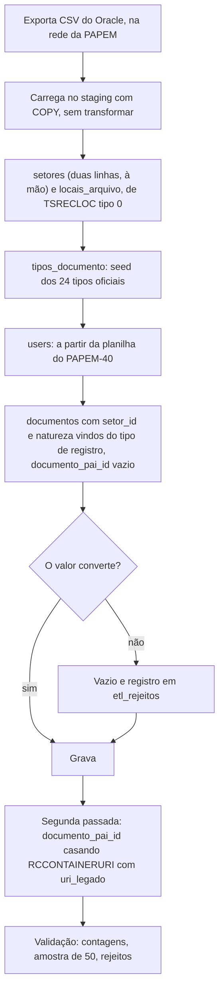
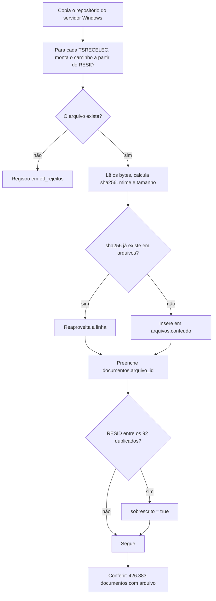

# SISIMAGEM — Fluxos

Os fluxos do sistema novo e do ETL. Quando algo veio do legado, está dito.

## 1. Login

No legado o contador ficava na sessão e não era gravado; aqui fica no banco.
A mensagem de erro é a mesma para usuário inexistente, bloqueado ou senha
errada.

## 2. Busca

O filtro de setor é escopo do Model, não depende do formulário.

## 3. Download

O pedido nunca traz caminho. No legado o cliente mandava o caminho do
arquivo e o servidor o abria sem conferir.

## 4. Inclusão de documento

No legado o arquivo era gravado em disco antes do banco e fora da transação:
uma falha deixava arquivo órfão, e o nome sequencial gerado por contagem
causou os 92 arquivos sobrescritos.

## 5. ETL de metadados

## 6. ETL de arquivos

A regra do caminho vem do código do legado e ainda não foi confirmada no
servidor de arquivos.
